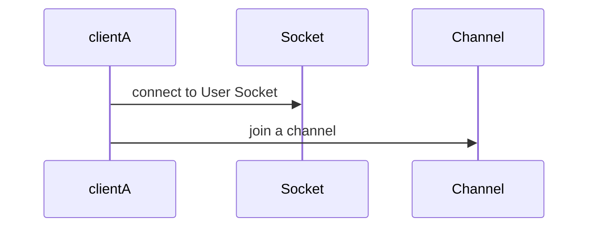
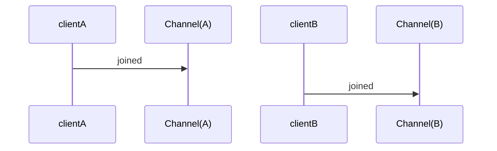
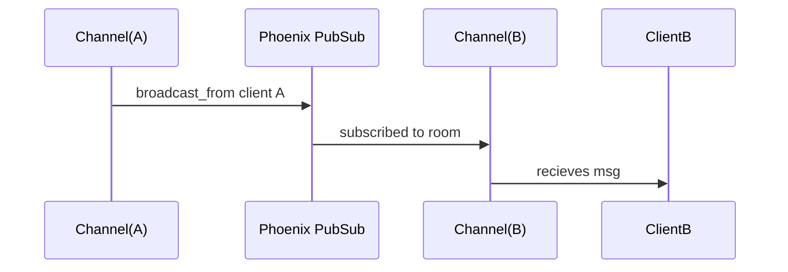

## Meeting Room Communications

Now that we have a page for a particular room at `/rooms/some-room-id-randomly-generated` let's see if we can send messages back and forth between another browser connected to the same room URL.

We don't have much of a UI in our room yet, but don't worry we don't need it yet.  Let's just get the backend mechanics set up so we can send and receive messages.

### Basic Socket Channel Concepts:

In javascript land we're going to connect to a web socket at an address hosted by the server.  




Another client B, does the same.  



A channel is basically a litle machine that processes incoming messages.  Client A and Client B are both connected to little servers called processes (or GenServers).  And these channel processes are all subscribed to the same PubSub topic, so if Client A broadcasts a message on the topic, then Client B or any number of connected clients will receive the message.



### Create a User Socket

Ok, enough theory let's create this socket thing.  Fortunately phoenix includes a generator for that too.  Run the following command in your terminal in your projects root folder but don't follow the instructions it spits out in the terminal.  We'll be doing something slightly different since we already have a liveview socket so we can piggy back on.  In other words the generator created a new js client and wants us to add a new endpoint, however we can just share the liveview socket that so that our front-end client doesn't need to join two different sockets.

```bash
mix phx.gen.socket User
```
This creates two files. 

```bash
* creating lib/xr_web/channels/user_socket.ex
* creating assets/js/user_socket.js
```
We're going to merge some of the javascript code in `user_socket.js` into `app.ts` in moment.  

### Create a Room Channel

Next we need to create a channel.  Channels can be made for different kinds of communication.  This one will be for communications and happenings that occur in a Room, so let's call it a `RoomChannel`.  And wouldn't you know it, there's a generator for that too.  Run this in the terminal as well.

```bash
mix phx.gen.channel Room
```
The autogenerated code in the user_socket.ex and room_channel.ex are 90% what we want, we just need to make a few tweaks.

### Let UserSocket Know About RoomChannel

Open `lib/xr_web/channels/user_socket.ex` and add this line:

```elixir
  channel "room:*", XrWeb.RoomChannel
```
In fact, that line might be there already, just uncomment it.  This `room:*` pattern means that the `RoomChannel` module will be used as a template to spawn new channel processes whenever a client joins a channel with the topic starting with "room:" e.g. "room:42".

### Modify RoomChannel Join function

Let's also modify the join function in the `room_channel.ex`

The generator created code that looks like this: 

```elixir
  def join("room:lobby", payload, socket) do
    if authorized?(payload) do
      {:ok, socket}
    else
      {:error, %{reason: "unauthorized"}}
    end
  end
```

We'll add authorization later, so just remove that bit for now.  Notice the pattern "room:lobby" is currently hardcoded.  This means this room channel can only handle one specific meeting room / topic, the room:lobby.  We want to handle arbitrary meeting room ids.  We want to change it to look like this:


```elixir
  def join("room:" <> room_id, payload, socket) do
    {:ok, assign(socket, :room_id, room_id)}
  end
```

This `"room:" <> room_id` means we are pattern matching on a string that starts with "room:" followed by a variable that will match the rest of the string.  It's similar to destructuring in javascript.

Here's an example of this kind of pattern matching happening for "=" operator.

```elixir
iex(1)> "room:" <> room_id = "room:42"
"room:42"
iex(2)> room_id
"42"
```

The same kind of pattern matching is applied to function heads like `join` and in this case we're capturing the value of `room_id` then assigning it into the socket for use later on.

### Sharing the liveview socket

It turns out that Phoenx Liveview already comes with a web socket to send data diffs to the front-end to render components without re-rendering the whole page.  We've been using it already, the generator that we used to create the CRUD pages for rooms uses Liveview.

Look inside `assets/js/app.ts`

```javascript
let liveSocket = new LiveSocket("/live", Socket, {params: {_csrf_token: csrfToken}})

```

The "/live" part references this endpoint defined in `endpoint.ex`

```elixir
socket "/live", Phoenix.LiveView.Socket, websocket: [connect_info: [session: @session_options]]

```

We can reuse this endpoint so that our front-end javascript code does not need to create an additional web socket just for our `UserSocket`.

Just add this line underneath that socket like this in `endpoint.ex`: 

```elixir
  socket "/live", Phoenix.LiveView.Socket, websocket: [connect_info: [session: @session_options]]

  socket "/live", XrWeb.UserSocket, websocket: [connect_info: [session: @session_options]]
```

Back in user_socket.ex comment out the default `use Phoenix.Socket` macro and replace with `use Phoenix.LiveView.Socket`.  This allows `UserSocket` to share the `LiveView` Socket:

```elixir
  # use Phoenix.Socket
  use Phoenix.LiveView.Socket
```

That will allow the `UserSocket` to piggyback on the LiveView socket.

### Join the Room Channel

Now we'll integrate parts of the advice in `user_socket.js` into `app.ts`.  Since app.js is loaded on every page of our website, but we only want the channel to join the room when we're on a URL like `/rooms/:id`.  My solution to that is that we'll create a global function called `initRoom` in `app.ts` that we'll then call from the `show.html.heex`.  This gives us the behavior that I want because that `show.html.heex` template only renders when we're on the rooms `show` CRUD path (when we navigate to a specific room).

Add the following snippet to `app.ts` after the liveSocket is created.  This creates an `initRoom` function that will join the `room` channel.  Notice the function takes two arguments, room_id and user_id which we can pass from the server to the browser.  This will be useful for knowing who we are.

```javascript
window["initRoom"] = async (room_id: string, user_id: string) => {
 
  liveSocket.connect(); // make sure we're connected first
  let channel = liveSocket.channel(`room:${room_id}`, {})
  channel.join()
    .receive("ok", resp => { console.log("Joined successfully", resp) })
    .receive("error", resp => { console.log("Unable to join", resp) })

}
```

Now we need to call this function, but we need to make sure we wait long enough until the browser has evaluated the initRoom function definition.  We'll get an error that `initRoom` is undefined if we just call it immediately.  Open up `controllers/room_html/show.html.heex` and replace the entire template with this:

```html
<body>
<script>
  window.addEventListener("DOMContentLoaded", function() {
    window.initRoom("<%= @room.id %>", "<%= @user_id %>")
  })
</script>
</body>
```

This code waits until all the DOM content is loaded before calling the `initRoom` function.  If you now navigate to any room you previously created and inspect the browser's console logs you should see:

```
Joined Successfully
```

You won't see that console.log output on any other page you navigate to, which is what we want.  Congrats!  That was a lot of stuff, but we now have our front-end connected over web sockets and a room channel all the way to the backend!  We're ready to send and receive messages!

### Send and Receive a Test Message

I've you are new to sending messages with channels, here's a quick demonstration.  Feel free to skim this section if you're already familiar with it.

Since we don't have a pretty UI or even buttons we can press to send any messages.  We're going to cheat a little bit and make a quick little test so we can be satisfied at our progress.  In `app.ts` where we just created the channel, go ahead an assign it to the window object.  This will allow us to access the channel from the browser's console.

```javascript
let channel = liveSocket.channel(`room:${room_id}`, {})
window.channel = channel
```

Now back in our browser, open up the dev tools and in the console tab run this command:

```javascript
channel.push("hi there")
```
This tells the browser to push the message "hi there" to the  `RoomChannel`. You may notice that doing so is immedately causes this message to appear in the console:
```
Joined Successfully
```
And that's because we caused the `RoomChannel` to crash because it doesn't know how to handle a message like "hi there".  Since the RoomChannel is supervised, when it crashes it is automatically and immediately respawned and our browser simply joins it again.  How awesome is that?

Take a look at the Phoenix logs and you'll see the error that caused the `RoomChannel` process to crash:

```elixir
[error] GenServer #PID<0.1280.0> terminating
** (FunctionClauseError) no function clause matching in XrWeb.RoomChannel.handle_in/3
    (xr 0.1.0) lib/xr_web/channels/room_channel.ex:18: XrWeb.RoomChannel.handle_in("hi there", %{},
    ...
    ...

```
This error message tells us exactly what we need to do to fix this.  Add a handle_in function that takes 3 arguments where the first argument is the pattern "hi there".

If we look into room_channel.ex you'll notice that there are already two handle_in examples that were autogenerated by the Phoenix generator:

```elixir
  def handle_in("ping", payload, socket) do
    {:reply, {:ok, payload}, socket}
  end

  # It is also common to receive messages from the client and
  # broadcast to everyone in the current topic (room:lobby).
  @impl true
  def handle_in("shout", payload, socket) do
    broadcast(socket, "shout", payload)
    {:noreply, socket}
  end
```

Let's change our message that we sent from the browser's console to this:

```javascript
channel.push("shout", {time: new Date()})
```

This time we sent a message that already had a `handle_in` defined and we added a second argument that is some arbitrary JSON payload I just made up.  The message and payload are broadcast to every connected client.  If we want to see that in javascript land let's add a javascript handler on the channel to react to the incoming message coming from the server.

Add this to code to `app.ts` after the `channel` variable is defined:
```javascript
channel.on("shout", payload => {
    console.log("I received a 'shout'", payload)
})
```

When the client receives an incoming message "shout" from the server, we'll print it to the console log.

Now open up another window/tab in your browser (or use anothe browser) and navigate to the same room URL.  Remember it has to be the same room id.  Place the windows side by side and open up the devtools console in both windows.  You should see that both window consoles show `Joined Successfully`.  Now repeat the 
```javascript
channel.push("shout", {time: new Date()})
``` 
command as before.  You see that the `I received a 'shout'` message is received across windows.  In order words, when you push a message from a client, the same message is forwarded to every connected client!

We successfully tested browser to browser interaction!  This forms the basis of being able to syncronize more complex payloads for games and other interactions.  We just have to define our message schemas and our handlers in both the `RoomChannel` and the javascript side.

## Securing the WebSocket

At this point we've proven that we can send messages back and forth from one browser to another.  We've sort of played it fast and loose so let's go back and tidy a few things up.  Phoenix provides a way of doing authentication in the `UserSocket`.  You may have noticed code snippets in the code generated in `user_socket.js` that tells us what to add.  The basic idea is that our backend will send a bit of encrypted data to the front-end such as the user's id.  And when we connect to the socket from the front-end we'll send that encrypted data back to the server for verification.  Any party that attempts to connect to our socket without providing the user token will not be able to join our room channel.  In the `UserSocket` module we'll unencrypt the user token, retrieving the user_id and add it into the socket so that it's available in the `RoomChannel`.  That's a lot to take in.  

First we'll need a user_id.

### Creating a unique id per visitor

We'll defer creating a full fledged login system until later.  But for now, we need a way give each visitor a unique id so that we can tell one person from another.  We'll also use the user_id as the bit of data to send back and forth for authentication.

Open up `router.ex` and type the following function:

```elixir
 def maybe_assign_user_id(conn, _) do
    case get_session(conn, :user_id) do
      nil ->
        user_id = Ecto.UUID.generate()
        conn |> put_session(:user_id, user_id) |> assign(:user_id, user_id)

      existing_id ->
        conn |> assign(:user_id, existing_id)
    end
  end
```

This function (known as a function plug), just follows a certain convention.  It takes a conn (a kind of connection struct), and second argument for some options that we don't care about now.  Then it creates a new conn that adds a unique user_id into the cookie session, but only if it wasn't there already.  That means we get a sticky identifier for each visitor.  We also add the user_id into the `assigns` map of the `conn` so that it's readily available.

Next we'll add this plug into the browser pipeline so that every page load will process our plug function:

```elixir
pipeline :browser do
  plug :accepts, ["html"]
  ...
  #add it at the end
  plug :maybe_assign_user_id
end
```

Now every visitor to the website will get a unique user_id in their session and they haven't even had to login or register.  How convenient!

### Add User Token to Conn

We now have a unique user_id in the cookie session.  But we need to send it down to the front-end encrypted as a user_token.  Let's add another function plug in `router.ex` for creating an encrypted token from the user_id.  We'll then pass this to the frontend so it can be passed back to the server and verified in the `UserSocket`

```elixir
 defp put_user_token(conn, _) do
   if user_id = conn.assigns[:user_id] do
     token = Phoenix.Token.sign(conn, "some salt", user_id)
     assign(conn, :user_token, token)
   else
     conn
   end
 end
```

This code signs a token with "some salt" for now.  And assigns it to the `conn`, so it's available in our templates.

Again, add this plug in the browser pipeline, but put it after our last plug because we depend on user_id being in the `conn.assigns`:

```elixir
pipeline :browser do
  plug :accepts, ["html"]
  ...
  #add it at the end
  plug :maybe_assign_user_id
  plug :put_user_token
end
```

### Add User Token to Frontend

Now we need to pass this token to JavaScript. We could add a snippet of javascript to set the token on the window object, but I'm paranoid that the evaluation order of script tags makes this vulnerable to race conditions.  I'll side step the paranoia by just injecting the token into the HTML at `root.html.heex` layout.  This is also what Phoenix itself does with the csrf_token.

```html
<meta name="user-token" content={assigns[:user_token]} />
```

### Add User Token to Client Side Socket Connection Code

Then when we make the liveSocket in `app.ts` let's grab it and pass it in the `LiveSocket` constructor options.  Again this is following what Phoenix does with the csrf_token.  Your `liveSocket` should look like this:

```javascript
let userToken = document
  .querySelector("meta[name='user-token']")
  .getAttribute("content");

let liveSocket = new LiveSocket("/live", Socket, {params: {_csrf_token: csrfToken, _user_token: userToken}});
```

### Verify User Token in Server side Socket Connect Callback

Now we open up `user_socket.ex` and replace the default `connect` function with this snippet that will verify the user token:

```elixir
@impl true
def connect(%{"_user_token" => token}, socket, _connect_info) do
  case Phoenix.Token.verify(socket, "some salt", token, max_age: 1_209_600) do
    {:ok, user_id} ->
      {:ok, assign(socket, user_id: user_id)}

    {:error, _reason} ->
      :error
  end
end

# if user_token is not provided, which is the case for phoenix live dashboard
# return :ok, so the socket can still connect, but the room channel don't allow join to succeed
@impl true
def connect(_, socket, _connect_info) do
  {:ok, socket}
end
```

### Verify RoomChannel Gets UserId

At this point we have completed authenticating the socket and we have this additional user_id in the socket we can use in `RoomChannel`.  Let's test that everything is hooked up properly by broadcasting the `room_id` and `user_id` whenever any client joins.

Open up `room_channel.ex` and modify `join` function to be like this:

```elixir
def join("room:" <> room_id, _payload, socket) do
  if (socket.assigns.user_id) do
    send(self(), :after_join)
    {:ok, assign(socket, :room_id, room_id)}
  else
    {:error, %{reason: "unauthorized"}}
  end
end
```

The `join` function, on a successful operation should return a tuple with `{:ok, socket}`.  Here we are adding the room_id into the socket so we have some memory to use in other handlers.  `user_id` is already in the socket assigns thanks to the `UserSocket` connect callback putting it in there (we did that!).

This `send` function is a built in function that will send a message to any Elixir process.  In this case we're sending a message to ourselves, `self`, right after we've joined.  Once we've joined, (and not before) we can utilize the channel APIs like `push` (send a message to my client and no one elses), `broadcast` (send a message to all clients) etc.  We need to add a new handler to handle the `:after_join` message.

```elixir

  @impl true
  def handle_info(:after_join, socket) do
    broadcast(socket, "shout", %{user_id: socket.assigns.user_id, joined: socket.assigns.room_id})
    {:noreply, socket}
  end
```
This handler receives the `:after_join` message and will call the `broadcast` api to send an message to all the connected clients of this room.  Since our javascript code is already console.log-ing anytime the server is pushing down a message of event "shout", we can see this at play in the browser's console.  To test this, open up multiple browser windows, navigate to a specific room and view the console.logs.  

You should see something like:

```javascript
I received a 'shout' {joined: '0ba687f4-2dbc-428b-ba3a-a7699845f141', user_id: 'fe7aca02-d76f-4fc4-b92e-76cbd1b99d72'}
```

Yay!  We're seeing the user_id now.  Remember that to obtain a different user_id on the same browser, one of your windows needs to use Incognito mode, or just use a different browser on your machine.  This is because the session user_id is tied to the cookie which is shared among tabs and windows of the same browser and domain.  

We can safely delete `user_socket.js` now because we integrated its javascript code and all its advice.

### Summary

In this chapter we enabled room specific communications using Phoenix channels.  Using the built in Phoenix generators, we created a UserSocket and a RoomChannel that responds to incoming messages and pushes responses back to the client.  We piggybacked the UserSocket onto the existing liveview socket then customized the RoomChannel to accept any room_id.  In the client we wrote channel subscriptions using `channel.on` to respond to messages coming from the server and responded by printing something to the console.log.  We created sticky a user_id for every visitor.  We then secured the socket and channel by passing a user_token to the front-end and then back to the server for verification. 