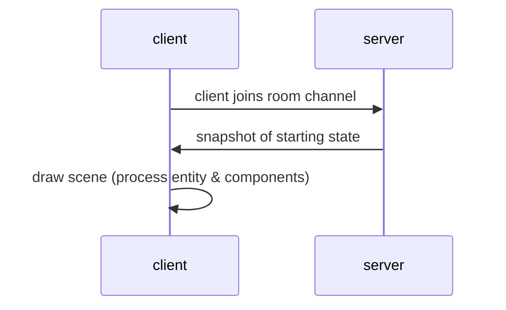
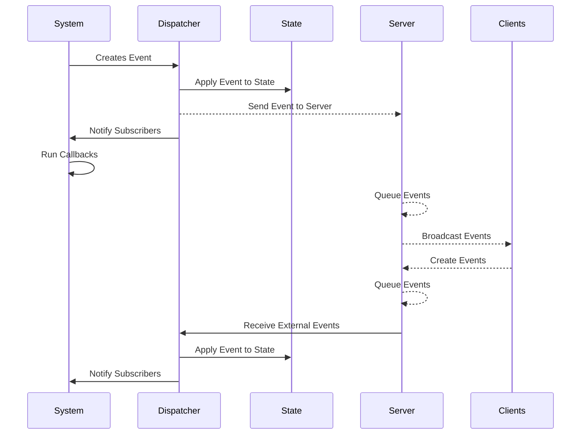
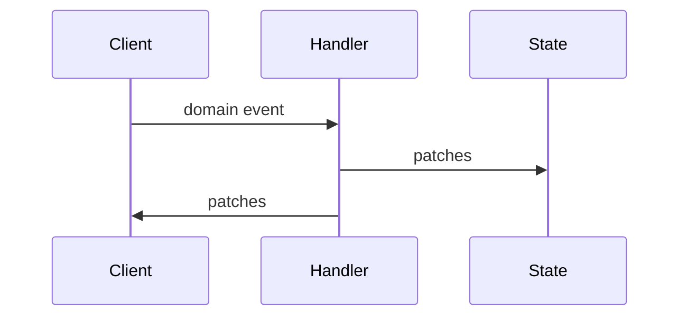
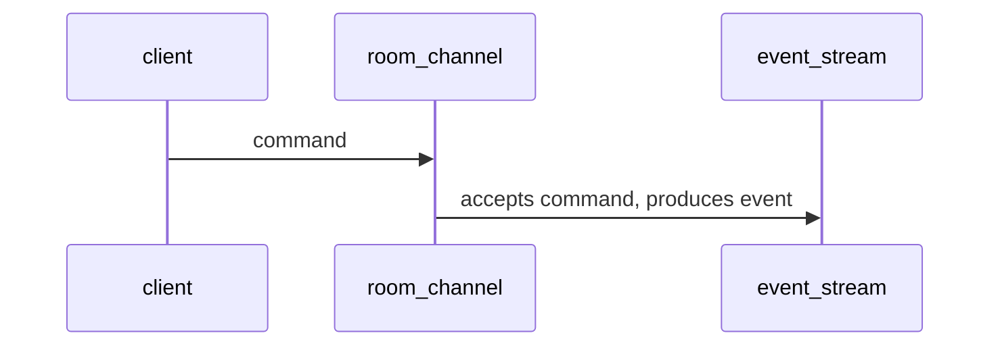
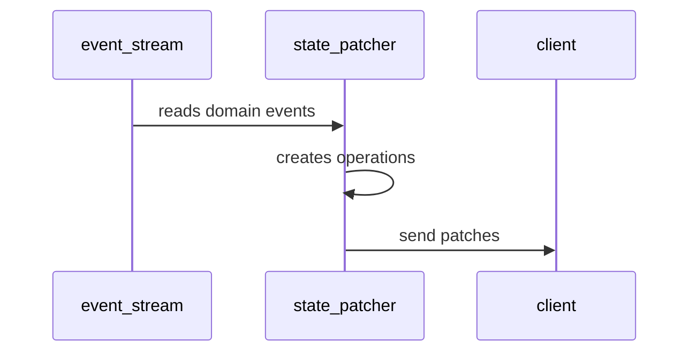
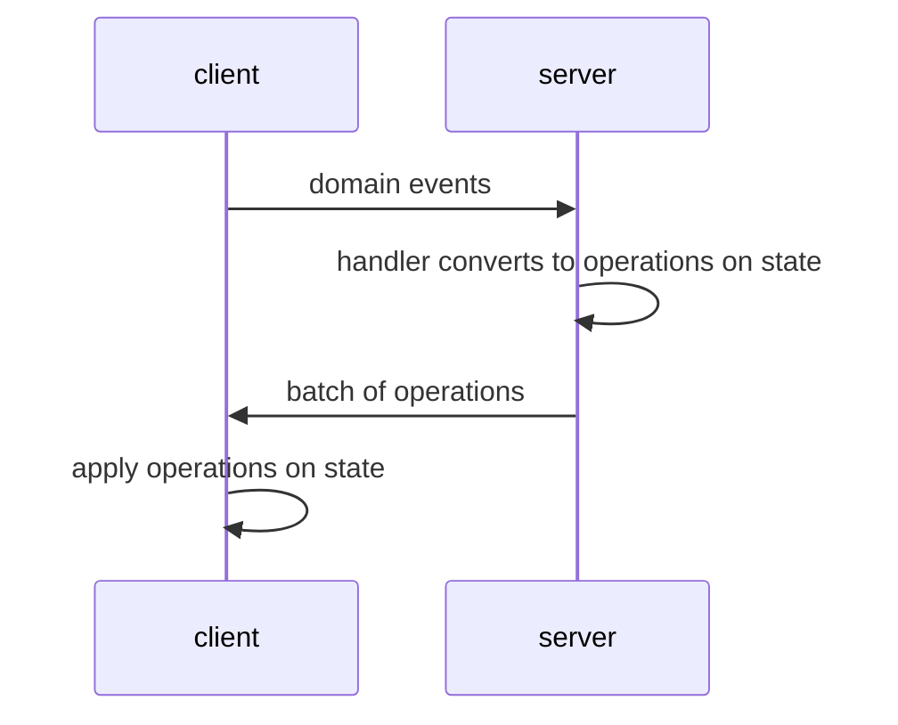

### Event Driven Architecture

Create a snippet table for storing snapshots of the room entities so we can reset the scene to a particular point.

```
 mix phx.gen.schema Snippet snippets room_id:references:rooms entity_id:uuid component_name:string component:map
```

create a domain level event log
 - store this in a ledger
 - transform this into state mutation
   - cache state into DB
   - send diffs to clients

- initial state is in a json snippet
- initial state is loaded into components table
- 
- modified state is in a gen server :ets table, copy on write
-   The ops are create, entity, components
-   followed by update, entity, components
-   followed by delete, entity, components
-   These are accumulated and then purged every 50 ms
-    to both the DB, and to every connected client
-    

-   
-   
- 


In a previous chapter we created some random colored obstacles in a room the moment it was created so that we could have something visual to look at that varied from room to room.

Here's a diagram of what we've implemented so far for getting some initial state:



Recall that the 'snapshot' message was an object with entity_ids as keys and components as values.

```json
{thing1: {position: [...], ...}, thing2: {...}}
```

This schema is sufficient to identify every object in the scene (every object has an entity_id).  And we can capture state regarding every entity using components, an arbitrariy defined object of key/value pairs.

### Game State

The state is any and all data that represents what all parties believe to be the current state of the world at any given moment.

It is useful for all parties to maintain their own local copy of state so that it can be queried for information which can be useful for decisions and logic. The goal is to keep the state periodically syncronized between all parties and minimize discrepancies between them.

### Incoming Changes

As time goes on and other players take actions it would be useful to get a message that told us how to update the client's local state.  There are only 3 basic operations that take place:

- create a new entity with components
- update an entity by updating components
- delete an entity

These messages can be applied on the state, updating the state to match the server's  state.

### Process Changes

As the state changes, we need to affect the scene.  Each system can pay attention to one or more components that have been updated and react accordingly.


### Save Snapshot To Game State

Let's create a game state system and when we receive the initial snapshot message we'll store all the entity and component data into the game state.


Let's explore what kind of messages can occur during a game.

### An Example Set of Events

When I was in highschool, a popular first person shooter game at that time was DOOM.  If we list out all the types of events that can occur in a game like that we'd come up with something like this (this exercise is called event-storming):

#### Domain Events

1. Player joined
2. Player left
3. Player moved 
4. Player discharged a weapon
5. Player triggered a door open
6. Player hit by a fireball
7. Monster hit by a bullet
8. Monster died
9.  Player collected a weapon
10. Player switched to a different weapon
11. Player Collected health
12. Player Collected immunity
13. Player Collected ammo
14. Player Collected a key
15. Player was killed
16. Monster moved
17. Monster threw a fireball
18. Monster fireball moved
19. Level Won
20. Level Lost

That game may not have used events like this, but let's roll with this as an exercise.  Let's go through some of these events and explore what a data payload looks like.  Remember, our aim is to syncronize a common state object.  We should be able to write a function that takes a previous state and an event data payload and produce a new state.  If we make all events fit into a CRUDy style, then we won't have to write that many functions to update state.  Essentially there will be only 3 kinds of events:

- create an entity
- delete an entity
- update one or more components on an entity
  - set, replace the component with a new value
  - inc, increase the component with a relative value
  - dec, decrease the component with a relative value
  - inc_max, increase the component value but not to exceed a max value
  - dec_min, decrease the component value but not become lower than a min value
  


#### Player Joined

```json
{
    note: "user_joined",
    op: "create",
    entity_id: "user123",
    components: {avatar: ..., position: [...], rotation: [...]}}
}
```

A new user appearing in the space would be represented as a brand new entity.  A new entity is accompanied by all it's starting components. This is inserting a key in an object.

In the front-end this could be merged into a state by doing:

```typescript
state[entity_id] = components
```
Or if each component is an object then:

```typescript
// for each component key/value
state[component_name][entity_id] = component_value
```

#### Player Left

```json
{
  note: "user_left",
  op: "delete",
  entity_id: "user123"
}
```

Remove an entity from the state object.  That should be as simple as deleting a key from an object.

#### Player Moved

```json
{
    note: "user_moved",
    op: "set",
    entity_id: "user123",
    components: { 
        position: [...], rotation: [...]
    }
}
```

A "set" operation will replace a key in components with a new value for an entity.

#### Player discharged a weapon
```json
{
    note: "bullet_fired",
    op: "create",
    entity_id: "rand234",
    components: { 
        position: [...], direction: [...]
    }
}
```

This one is interesting because want to create a new visible object in the scene, a flying bullet.  But also animate it continuously toward the target.  There are two ways we can do this.  Either receive a stream of new positions over time, or just get one message for the direction the bullet should travel and just animate it locally without additional messages.  

In the first way, any one who jumps into the room while the bullet is in mid-flight will get an update soon enough on where the bullet should be.  So this is good for slow moving projectiles.  

In the second way, the flight might be smoother without periodic positions since network delays and timings will probably result in a less than perfectly smooth animation.  But if a person joins the room late they would miss the animation event and never see it.  Or if the initial state they download contains an entity with a flying bullet and they start it now, it will also be a state that isn't what others see.  We'll need to decide how important synced state is to us.

#### Player triggered a door open

```json
{
    note: "door opened",
    op: "set",
    entity_id: "door123",
    components: {
        door_state: "opened"
    }
}
```

Similar to the bullet scenario, anything that involves animation can be designed as a series of update messages, or just one message for the ending state.

#### Player Hit by a Fireball

This involves more than one entity.  There is the fireball that is in flight and the person that was struck by the fireball.  In this case we could generate more than one state change operation.  The fireball needs to explode and be removed.  The player needs to accumulate some damage.
```json
{ 
    note: "player hit by fireball",   
    op: "set",
    entity_id: "fireball_123"
    components: {
        fireball_state: "hit",
        ttl: 10
    }
},   
{
    op: "dec",
    entity_id: "user123",
    components: {
        health: 10
    }
}
    

```
The first operation will first set a component to indicate that it hit something.  That could trigger the view to create a blast explosion and play a sound.  The ttl of 10 ms, informs the front-end to remove the fireball nearly instantaneously.  The second operation deducts 10 from the health of the player that was hit.  

#### Monster hit by a bullet

```json
{ 
    note: "monster hit by bullet",   
    op: "set",
    entity_id: "bullet_123"
    components: {
        bullet_state: "hit"
        ttl: 10
    }
},
{
    op: "set",
    entity_id: "monster123",
    components: {
        monster_state: "monster_pain"
    }
}
``` 

#### Monster died

```json
{
    op: "set",
    entity_id: "monster123",
    components: {
        monster_state: "monster_dying"
        ttl: 2000
    }
}
```

#### Player Collect Item

The player collecting any item should be at least two events.  One to remove or hide the item from the scene.  One to increase a variable that represents items in that player's possesion.

```json
{
    note: "player collected health",
    op: "delete",
    entity_id: "item234"
},
{
    op: "inc_to_100",
    entity_id: "user123",
    components: {
        health: 10
    }
}
```
Picking up a unique item that is already in the scene can be hiding the visibility and setting ownership:
```json
{
    note: "player collected weapon",
    op: "set",
    entity_id: "weapon123"
    components: {
        visibility: false,
        owned_by: "user567"
    }
}
```
#### Player Killed
This message can be emitted by observing a player's health.  When it goes to zero emit another event.

```json
{
    note: "player killed",
    op: "set",
    entity_id: "user123",
    components: {
        status: "died"
    }
}
```

#### Monster Moved

This is similar to a player moved event except that it would be generated by AI instead of being produced by a user.


#### Monster Threw Fireball

Similar to player firing a projectile, except that it is generated by AI.

#### Level Won

This one is a little odd because the level is not normally thought of as an entity.  But since we're saying that everything is an entity, we can just tag one entity as a game and add a status as a component of that entity:

```json
{
    note: "level won",
    op: "set",
    entity_id: "rand123",
    components: {
        status: "level_won",
        tag: "game_state" // previously set
    }
}
```

#### Level Lost


```json
{
    note: "level lost",
    op: "set",
    entity_id: "rand123",
    components: {
        status: "level_lost",
        tag: "game_state" // previously set
    }
}
```


### Flow of Events




Notice how these descriptions almost read like a story?  I call these domain events because they use the language of the domain. 

- This style of events can be advantageous for story telling.  For example one could build audio or subtitling features for visually impaired or for other accessiblity features.  

- This message schema doesn't follow any particular constraint and need not be tied directly to a property or component of an entity.  It merely describes some event that we're interested in and can flexibly contain any information that we want.  For example "game_ended" could be an event.
- 

### Event Handlers

Once these domain events land on the server-side, each event type will need an event handler that understands how the message is supposed to change the state.  The event handler will produce one or more state patch operations.  These patch events are queued then broadcast to all clients on a set frequency so that all clients can process them and update their local states.




### Event Sourcing
  
There is an architectural pattern called event sourcing where every thing important to us that can happen in a room is piped into an ordered stream of events (called an Event Stream).  An event is a fact that has just happened.  It has just enough information to allow us to re-create the state (or view/projection) purely from processing those events in order again.  

We can have any number of subscribers listening to the event stream building up their own "projections", aka views of the data that are built-up by processing each event.

Our front-end will produce a stream of data when a user performs local actions.  We'll call these messages "commands" from event-sourcing lingo.  A command can be rejected whereas an event cannot.  An event is fact.

The RoomChannel will receive the command and reformat the message slightly and send it to the event stream if the command is accepted.




State Patching Projection is a process that receives the domain events and converts them into operations to patch the shared state.  It also broadcasts the diffs to the client.



### Sending Events

We learned in a previous chapter that we can send messages to the server using Phoenix Channels.  We built a room channel for this purpose.  

On the client side we can send outgoing messages using `channel.push(event_name, event_payload)`.  

### Server Side Event Processing

On the server side, in `RoomChannel` we would need to add handlers to receive the incoming messages from the client.  There are all kinds of things we could do with the messages.  We could stash them all into a log for auditing.  We could update the latest room state and serialize it into a database.  We could batch all the state changes then sync them to all clients at regular intervals.  

### Client-side Delta Processing

Then back in the client side, we need to listen to incoming batched messages from the server using `channel.on("state_patch", () => { ... handler ...})`.  In this setup, the event that the front-end listens to can be different than the event that was sent from the front-end.  



The messages that are sent from the client are domain style events.  The message that are received from the server are a batch of state patches.  As each patch is applied to the state, the front-end will dispatch a local message such that the developer has a way to subscribe to:

- when an entity is added
- when an entity is removed
- when a component is changed


It seems plausible that we'd be able to use Babylon.js to detect in the client when these things occur and emit a command to the RoomChannel.  The RoomChannel will convert the command into a domain event and send it to an event stream.


### State Change Events

In contrast to domain events which use the language of what's happening in the world, state change events are based around CrUD (Create, Update, Delete).  This is because when a shared state, which is something like an object, is being mutated we can buffer a set of operations that can be synced to all clients to bring their copy of the state up to parody.  

```json
{op: "update", key_path: "entities.item-1.position", value: [1,2,3]},
{op: "create", key_path: "entities.new-item", value: {position: [...], rotation: [...]}},
{op: "delete", key_path: "entities.monster-5" }
```

These events are patched into the client's local state which then triggers listeners in systems that want to know when specific properties have changed

In this second schema style, the format is more consistent and more rigid having an envelope of { entity: ... , components: } for every kind of event.  It prioritizes reusablity of a fixed set of components.  This has the advantage of not specifying or needing to match on event names or creating new events names for more behaviors, rather one would create new component names for use by systems.  This styles is more CRUDy in that it involves either creating a new entity, or updating it (it's components), or deleting an entity.  It's easier to create a snapshot of the world from these events since there are only a small number of operations, and generally it's just deleting an entity or merging changed components into an existing entity record.  These messages tend to describe the current state of an entity rather than a fact that happened.  Instead of saying that "a user grabbed a thing", it would become a stream of data events that "the thing is now at this position", or a component of "parent" on the item becoming set to the id of the the hand that is grabbing it.  The component can achieve the same visual result but may take more messages.

Some domain events can't be expressed using this schema such as "game over" event, which doesn't involve an entity_id.  Unless we model game state as an entity:

```json
{event: "create", payload: {entity_id: "...", components: {game: "in_progress"}}},
// if game is lost
{event: "update", payload: {entity_id: "...", components: {game: "lost"}}}
```


### Tracking Data That Needs To Be Synced

Networked games are merely independent simulations that sync data to update the same components on entities in their peers.  99% of the time, that data that needs syncing is spatial data.  It is position, rotation, scaling, perhaps color for simple objects that can change color, perhaps light intensity for things like lights that have attributes like intensity and direction.

If we manipulate that data locally through APIs, we can mark the components and values that need to be synced then send them out, that way we're only sending the differences that have changed.

In fact we could orient the messages as component first rather than entity first:

```json
{ 
    position: {thing1: [...], thing2: [...]}
    velocity: {thing3: [...]}
}
```


#### Snapshot Events

Another approach that can work is to send a snapshot of the current state of the world.  Instead of sending individual entity based messages, you send the state of every entity constantly.  This would be a list of all the enemy positions, every bullet in flight, every player's state, etc.  And the client would need to render the updates, create any added entities, or remove any entities not in the snapshot.

This might lead to very large payloads so maybe we only want to send a list of the entities that had changed since the last event.  This snapshot might look like this:

```json
{monsters: [], players: [], keys: [], doors: [], bullets: [], ...}
```


### Message Producers

A message can originate from different sources depending on these scenarios:

1. Initial state snapshot.  We already implemented this.  This message originates from the server and is sent to the client when they join so they can draw all the initial scene.
2. User generated events.  These are messages that the user initiates by taking some action.  These messages originate in the front-end and are sent to the server and then broadcast to all the other connected clients.
3. System generated events.  These are messages that are indirectly triggered by something that has happened.  It could even be just the passing of time.  For example we could have a system that emits periodic events to open a door every 60 seconds then close 15 seconds after that.  We could have a system observe if bullets actually hit zombies and emit an event that the zombie was killed.  These events also originate on the client but should only come from one client otherwise we could end up with duplicate or conflicting events if they are calculated on every client.
4. Server generated event.  Lastly these types of events come from the server and supplement events that cannot be generated on the client side.  For example the client cannot tell us they have left if they just close their browser and disconnect.  The server however can detect that the client has detached and emit an event that that user left.

### Phoenix PubSub as an Event Stream

Phoenix comes with a library called PubSub which allows any process to subscribe or broadcast on a named topic.  This is very convenient to easily allow any Elixir process to talk to another process.  

Here's an example of how to use PubSub in the iex terminal:

```elixir
alias Phoenix.PubSub
PubSub.subscribe(Xr.PubSub, "stream:123")
:ok
Process.info(self(), :messages)
{:messages, []}
PubSub.broadcast(Xr.PubSub, "stream:123", {"user_moved", %{"user_id" => "tom", "pose" => ...}})
:ok
Process.info(self(), :messages)
{:messages, [{"user_moved", %{"user_id" => "tom", "pose" => ...}}]}
```
In this simple example we subscribe to a topic "stream:123", broadcast a message to it and then see that our process mailbox received the message.

This understanding sets us up to create an event-stream for our room.  Everything that is important about a room should be broadcast on the stream.

### Create State Patcher Module

Receives a domain event, returns an operation.

Operation applier, takes an operation and updates a database

Operation patcher takes a domain event and asyncronously creates an operation, sends to update database and and batches them out at a set patch frequency.  It is a genserver.

front end code receives patches, sends into eventbus for entity creates, entity deletes, component updates and 