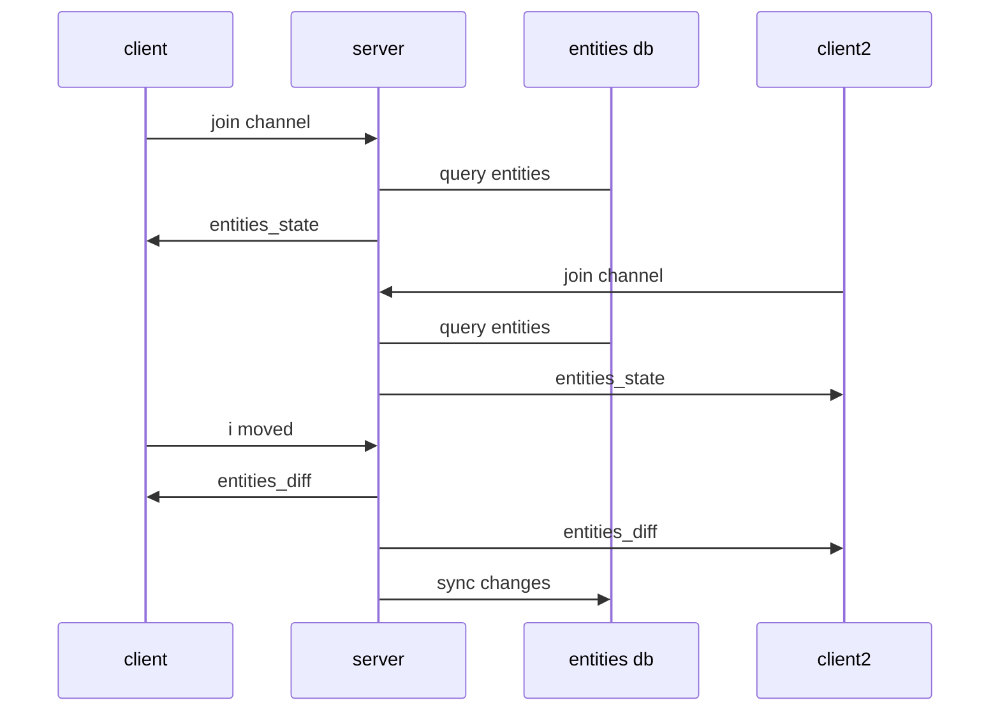

## Tracking EntitiesDiff Changes

When we initially join the channel, room channel will push:

```elixir
push(socket, "entities_state", entities)
```
This gives the frontend information about everything we know to be true in the room.  We call this "the state".

```json
{ 
  entity_id1: { position: [0,0,0] }, 
  entity_id2: {...}
}
```

And the systems will dutifully manipulate the scene to match the state.  But what happens if there are on going changes to the state?  For example the entities change positions.

When there are changes to the state of the world those changes can be expressed as an "entities_diff" event with this shape:

```typescript
{
    creates: {},
    updates: { entity1: { position: [-1,0,-1.2] }},
    deletes: {}
}
```
The keys represent the operation on the state, whether entities have been created, deleted or updated.  And the values are objects with entity_ids as keys and components as values.  These events are very CRUD like and are useful for syncing state.

We need to create a server that listens to room events (things that happen in the room) and then converts those events into "entities_diff" events.



### Define Room Events

What are room events and how are they different than entities_diff events?  Basically room events consist of an event name and a payload but aren't CRUD focused.  They describe what happens in a room with a minimal payload.  Here's some examples:

```json
{event: "user_joined", payload: {user_id: "bob", position: [...], rotation: [...]}}
{event: "user_moved", payload: {user_id: "bob", position: [...], rotation: [...]}}
{event: "user_left", payload: {user_id: "bob"}}
```
These events should read like a story.  They don't know about entities or components or state, (although there is a lot of data overlap).  A room event can involve more than one entity, for example a user grabbing a thing.  The room event is about the "what", and the entities_diff is more about the "how".  entities_diff events are focused on syncing state and therefore it's more difficult to read them and know the intent.  Room events and entities_diff are related but decoupled such that we can retain the original room events yet change out the implementation of components in entities_diff that we decide to produce from the room events.

### Transformation Example

The State, is the current collection of entities and components that we have stored in our database.  When room events happen, we need to translate them into an entities_diff event that tells us how we should update the database.

For example, a "user_joined" event translates from:

```json
// room event
{ event: "user_joined", payload: {user_id: "123abc", position: [...], rotation: [...]}}
// translates into entities_diff event
{creates: {123abc: {position:[...], rotation:[...]}}}
```

A "user_left" event:

```json
// room event
{ event: "user_left", payload: {user_id: "123abc"}}
// translates into entities_diff event
{deletes: {123abc: {}}}
```

### Phoenix PubSub as an Event Stream

Phoenix comes with a library called PubSub which allows any process to subscribe or broadcast on a named topic.  This is very convenient to easily allow any Elixir process to talk to another process.  

Here's an example of how to use PubSub in the iex terminal:

```elixir
alias Phoenix.PubSub
PubSub.subscribe(Xr.PubSub, "stream:123")
:ok
Process.info(self(), :messages)
{:messages, []}
PubSub.broadcast(Xr.PubSub, "stream:123", {"user_moved", %{"user_id" => "tom", "pose" => ...}})
:ok
Process.info(self(), :messages)
{:messages, [{"user_moved", %{"user_id" => "tom", "pose" => ...}}]}
```
In this simple example we subscribe to a topic "stream:123", broadcast a message to it and then see that our process mailbox received the message.

This understanding sets us up to create an event-stream for our room.  Everything that is important about a room should be broadcast on the stream.

### EntitiesDiff GenServer

Now we'll create a GenServer that will subscribe to a Phoenix PubSub topic and will translate room_events into entities_diff events.  We will use an ETS table to first store the state mutation operation per entity.  We'll use this ETS table to batch multiple entities and/or multiple operations per entity first.  Then on a sync frequency will dump the ETS table out and transform it into the final entities_diff format and broadcast it on the room channel topic back to all clients.

Create a new folder at `lib/xr/servers` where we'll put our genserver code.

At a new file there called `entities_diff.ex` and paste the following:

```elixir
defmodule Xr.Servers.EntitiesDiff do
  use GenServer
  alias Phoenix.PubSub
  
  def start_link(room_id) do
    GenServer.start_link(__MODULE__, {:ok, room_id})
  end

  def init({:ok, room_id}) do
    # subscribe to the room stream
    PubSub.subscribe(Xr.PubSub, "room_stream:#{room_id}")

    {:ok, %{room_id: room_id}}
  end

  # responds to incoming message from the room stream
  def handle_info(%{"event" => event, "payload" => payload}, state) do
    # do something
    {:noreply, state}
  end

end
```

This state genserver subscribes to a PubSub topic of `room_stream:#{room_id}`.  It then handles all possible messages from that topic.  We're going to save our state mutation operations in a memory database so that we can batch send all the entities that have changed on a set frequency.   


Here's a quick overview with what we can do with that GenServer already.  We can go to our terminal after starting `iex -S mix phx.server` and start an instance of this GenServer.

```elixir
>Xr.Servers.EntitiesDiff.start_link()
{:ok, #PID<0.524.0>}
```

We now have a tiny server!  That pid is the process id of our server.  If we pattern match it we can deconstruct the pid and check it's state.

```elixir
>{:ok, pid} = Xr.Servers.EntitiesDiff.start_link()
{:ok, #PID<0.525.0>}
>:sys.get_state(pid)
%{room_id: "3jfks"}
```

Next we'll want to add an in-memory database for our GenServer to use.  We'll use it to keep a stash of state mutations until our GenServer is ready to sync them out to all clients.

#### ETS Table

Elixir is based on Erlang and Erlang comes with a fast in-memory database called Erlang-Term-Storage (ETS).  Here are the basics:

To create a new ETS Table we do this:

```elixir
table = :ets.new(:some_atom, [:set, :public, {:write_concurrency, true},{:read_concurrency, true}])
```

The configuration above creates an ETS table that has:

- unique keys (desirable because every user_id is unique)
- is writable by all processes (in case we want to allow other processes to write to it)
- concurrent on reads and writes so multiple processes can access the data simultaneously

To insert data the API requires the table reference and a tuple of {key, value}

```elixir
> :ets.insert(table, {"key", %{}})
true
```

To lookup a value, we use the key:
```elixir
> :ets.lookup(table, "key")
[{"key", %{}}]
```
It returns a list of tuples of key and value.

You can get the whole table as a list of tuples of key and value:

```elixir
>:ets.tab2list(table)
[{"key", %{}}, ...]
```

An ETS table is linked to the process that created it.  So if the parent process dies or is shutdown than the child will be shutdown and memory reclaimed as well.  In order to access the ETS table we need to have its reference which was returned when it was created.  

### Room Event to ETS Table Function

Let's write module that is specifically tasked for pattern matching on room events and then inserting the state mutation into an ets table.

Let's start with an `insert` utility function

```elixir
  # internal api to insert a state change into the ets table
  # operation must be one of :create, :update, :delete
  # returns state with the entities_to_sync set updated
  def insert(entity_id, operation, payload, table) when is_atom(operation) and is_map(payload) do
    case :ets.lookup(table, entity_id) do
      [] ->
        map =
          %{:create => nil, :update => nil, :delete => nil}
          |> Map.put(operation, payload)

        :ets.insert(table, {entity_id, map})

      [{_key, map}] ->
        new_map =
          case operation do
            :update -> Map.put(map, operation, Map.merge(map[operation] || %{}, payload))
            _ -> Map.put(map, operation, payload)
          end

        :ets.insert(table, {entity_id, new_map})
    end
    # returns supplied entity_id
    {:ok, entity_id}
  end
```

This function takes an entity, an operation (one of :create, :update, :delete) and stores a map %{create: nil, update: nil, delete: nil}.  If this entity has more than one operation within the sync time, this object will hold it.  But most likely only one key will be populated with component data.

Once the data is in the ETS table, when we're ready to sync, we need to collect all the entries and make a "entities_diff" payload.  Here's a function to do that, again there are multiple function heads.

```elixir
@doc """
  convert table contents into entities_diff payload
  """
  def get_entities_diff(table) when not is_list(table) do
    case :ets.tab2list(table) do
      [] -> :nothing_to_sync
      data -> get_entities_diff(data)
    end
  end

  def get_entities_diff(data) when is_list(data) do
    empty_diff = %{creates: %{}, updates: %{}, deletes: %{}}

    to_sink =
      Enum.reduce(data, empty_diff, fn {entity_id, row_value}, acc ->
        get_entities_diff(acc, entity_id, row_value)
      end)

    {:ok, to_sink}
  end

  def get_entities_diff(acc, entity_id, row_value) when is_map(acc) do
    Enum.reduce(row_value, acc, fn {op, components}, acc ->
      case {op, components} do
        {_, nil} ->
          acc

        {:create, components} ->
          Map.put(acc, :creates, Map.put(acc[:creates], entity_id, components))

        {:update, components} ->
          Map.put(acc, :updates, Map.put(acc[:updates], entity_id, components))

        {:delete, components} ->
          Map.put(acc, :deletes, Map.put(acc[:deletes], entity_id, components))
      end
    end)
  end

```

Put both of those functions in a `lib/xr/utils` class and write a test for all our functions in there `test/xr/utils_test.exs`:

```elixir
defmodule Xr.Utils.Test do
  use ExUnit.Case, async: true

  alias Xr.Utils

  test "creates random string" do
    assert Utils.random_string() |> String.length() == 5
  end

  test "it inserts a state change into the ets table" do
    table = :ets.new(:table, [:set, :protected])
    Utils.insert("abc", :create, %{"position" => [1, 2, 3]}, table)

    assert [{id, %{create: %{"position" => [1, 2, 3]}, update: nil, delete: nil}}] =
             :ets.tab2list(table)

    assert id == "abc"
  end

  test "entities_diff" do
    table = :ets.new(:table, [:set, :protected])
    Utils.insert("abc", :create, %{"position" => [1, 2, 3]}, table)

    assert {:ok, %{creates: %{"abc" => %{"position" => [1, 2, 3]}}}} =
             Utils.get_entities_diff(table)

    Utils.insert("xyz", :delete, %{}, table)

    assert {:ok, %{creates: %{"abc" => %{"position" => [1, 2, 3]}}, deletes: %{"xyz" => %{}}}} =
             Utils.get_entities_diff(table)
  end

  test "entities_diff with nothing to sync" do
    table = :ets.new(:table, [:set, :protected])
    assert(:nothing_to_sync = Utils.get_entities_diff(table))
  end
end

```

Next let's write a process function with multiple function heads that match the incoming room events and then stash the state mutation operation into the ETS table.  Here we are starting with user_joined, user_left, user_moved room events.  Create a file (and folder) at `lib/xr/room_events/state_mutation.ex` and add the following:

```elixir
defmodule Xr.RoomEvents.StateMutation do
  # table is an ets table

  def process("user_joined", payload, table) do
    insert(payload["user_id"], :create, Map.drop(payload, ["user_id"]), table)
  end

  def process("user_left", payload, table) do
    insert(payload["user_id"], :delete, Map.drop(payload, ["user_id"]), table)
  end

  def process("user_moved", payload, table) do
    insert(payload["user_id"], :update, Map.drop(payload, ["user_id"]), table)
  end

  # unhandled event
  def process(_,_,_) do
    {:error, :not_handled}
  end

end
```

### Update EntitiesDiff GenServer

Let's utilize the the functions we made in our EntitiesDiff GenServer.  We'll also send ourselves a :sync message every @sync_interval number of ms to check if there are entity_diffs to send out.

```elixir
defmodule Xr.Servers.EntitiesDiff do
  use GenServer
  alias Phoenix.PubSub

  @sync_interval 200
  
  def start_link(room_id) do
    GenServer.start_link(__MODULE__, {:ok, room_id})
  end

  @impl true
  def init({:ok, room_id}) do
    # subscribe to the room stream
    PubSub.subscribe(Xr.PubSub, "room_stream:#{room_id}")

    # create an ets table
    table =
      :ets.new(:room_state, [
        :set,
        :public,
        {:write_concurrency, true},
        {:read_concurrency, true}
      ])

    Process.send_after(self(), :sync, @sync_interval)
    {:ok, %{room_id: room_id, table: table}}
  end

  # responds to incoming message from the room stream
  @impl true
  def handle_info(:sync, state) do
    Process.send_after(self(), :sync, @sync_interval)

    case Xr.Utils.get_entities_diff(state.table) do
      {:ok, to_sync} ->
        XrWeb.Endpoint.broadcast("room:" <> state.room_id, "entities_diff", to_sync)

        # clear the ets table
        :ets.delete_all_objects(state.table)
        # clear the entities to sync
        {:noreply, state}

      :nothing_to_sync ->
        {:noreply, state}
    end
  end

  def handle_info(%{"event" => event, "payload" => payload}, state) do
    Xr.Servers.EventToState.process(event, payload, state.table)
    {:noreply, state}
  end
end

```

We added the ETS to this genserver.  Whenever we process a room event, we'll stash the entity_id into entities_to_sync.  Then every @sync_interval we'll convert the ETS table contents into an entities_diff payload and delete the ETS table.


### Add Dynamic Supervisor

GenServers ought to be supervised so that if they crash they can be restarted.Let's add a supervisor for our State.  Create a new file at `lib/xr/servers/rooms_supervisor`

```elixir
defmodule Xr.Servers.RoomsSupervisor do
  use DynamicSupervisor

  def start_link(_arg) do
    DynamicSupervisor.start_link(__MODULE__, :ok, name: __MODULE__)
  end

  def init(:ok) do
    DynamicSupervisor.init(strategy: :one_for_one)
  end

  def start_room(room_id) do
    DynamicSupervisor.start_child(__MODULE__, {Xr.Servers.EntitiesDiff, room_id})
  end

end
```
When we use the start_room function, this RoomsSupervisor will create a new UserSnapshot GenServer as a child of itself.  This Supervisor can supervise multiple rooms.

```
             +----------+                  
         +---|Supervisor|--+               
         |   +----------+  |               
   +--------+       +--------+             
   | Room 1 |       | Room 2 |             
   | Child  |       | Child  |             
   +--------+       +--------+       
```

We want to start this supervisor automatically when Phoenix starts our application so add it to the bottom of the children list in `application.ex`.

```elixir
  children = [
    ....
    Xr.Servers.RoomsSupervisor
  ]
```

Now we can use the RoomsSupervisor to create our UserSnapshot GenServer when we launch into our room from the `show` function in the RoomsController.  Modify the show function like this:

```elixir
def show(conn, %{"id" => id}) do
  room = Rooms.get_room!(id)
  Xr.Servers.RoomsSupervisor.start_room(room.id)
  render(conn, :show, room: room)
end
```
This starts the EntitiesDiff Genserver if it hasn't already started, and if it has it will silently fail.


We also want to be able to stop GenServer in case we want to shut the game down.  In order to do that we need to know the pid of the GenServer.  We can use the local Registry for that.


### Add Local Registry for Unique GenServer Names

This GenServer is un-named right now, so we can't talk to it unless we have its pid.  But let's say we don't know its pid and we'd like to lookup this particular GenServer by a name.  A registry let's us do that.  The registry inserts a mapping between a name and a pid and also ensures that we won't accidentally start two of the same servers for the same room.  

Create a Registry by adding this line in the `applications.ex` children's list after the `Endpoint`:

```elixir
 {Registry, keys: :unique, name: Xr.RoomsRegistry},
```

Now we can name each process that is created from any GenServer we create using the `via_tuple` API.  Add this via_tuple function to our GenServer

### Add via_tuple function


```elixir
defmodule Xr.Servers.EntitiesDiff do
  use GenServer
  alias Phoenix.PubSub

  # creates a tuple that will automatically map a string "user_states:#{room_id}" to this new process
  def via_tuple(room_id) do
    {:via, Registry, {Xr.RoomsRegistry, "entities_diff:#{room_id}"}}
  end

  # use that as the :name option
  
  def start_link(room_id) do
    GenServer.start_link(__MODULE__, {:ok, room_id}, name: via_tuple(room_id))
  end
  ...

```

Now when we start that GenServer its pid is registered in the Registry.  Let's also add a stop_room function to the RoomSupervisor.

```elixir

  def stop_room(room_id) do
    DynamicSupervisor.terminate_child(
      __MODULE__,
      Xr.Servers.EntitiesDiff.via_tuple(room_id) |> GenServer.whereis()
    )
  end
```

### Update the Database Whenever Entities Diff is Broadcast

Let's write a test first:


### Summary

In this chapter we created an EntitiesDiff GenServer that can receive "room events" on a "room_stream:#{room_id}" pub/sub topic.  The GenServer is supervised under a RoomSupervisor and can be dynamically started and stopped.  The GenServer transforms incoming room messages into state mutations and stores them in an ETS table.  It will broadcast state mutations in a "entities_diff" message every @sync_internal time in ms.  We wrote unit tests to ensure our functions works and that the GenServer can update entitites state in the database.
