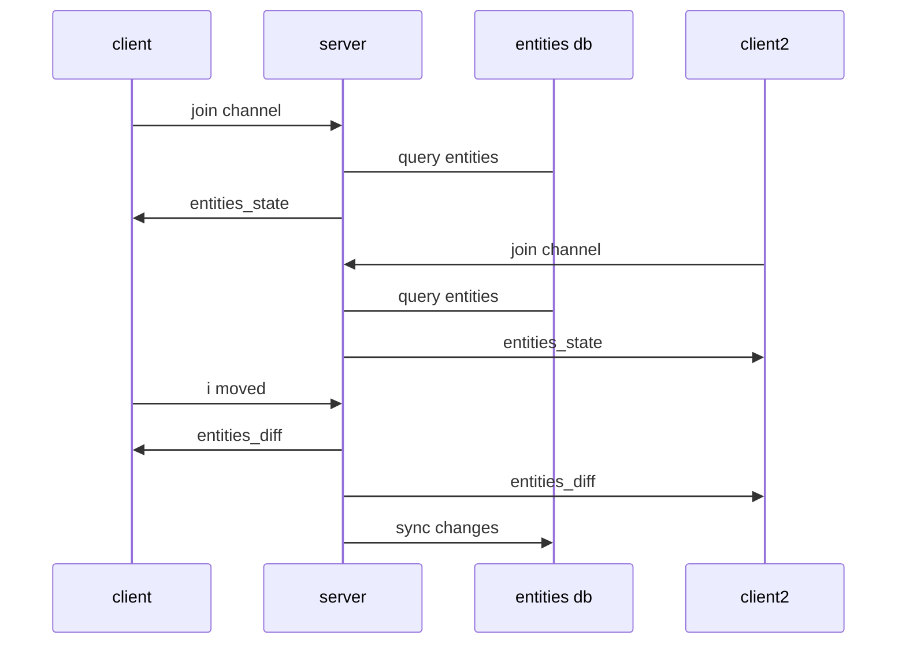

## Tracking State Changes

When we initially join the channel, room channel will push:

```elixir
push(socket, "entities_state", entities)
```
This gives the frontend information about everything we know to be true in the room.  We call this "the state".

```json
{ 
  entity_id1: { position: [0,0,0] }, 
  entity_id2: {...}
}
```

And the systems will dutifully draw all the entities in the room.  But what happens if there are changes to the state?  For example the entities change positions.

When there are changes to the state of the world those changes can be expressed as an "entities_diff" event with this shape:

```typescript
{
    creates: {},
    updates: { entity1: { position: [-1,0,-1.2] }},
    deletes: {}
}
```
The keys represent the operation on the state, whether entities have been created, deleted or updated.  And the values are objects with entity_ids as keys and components as values.  These events are very CRUD like and are useful for updating a database to sync state.

We need to create a server that listens to things that happen in the room and then converts those events into "entities_diff" events.



### Define Room Events

What are room events and how are they different than entities_diff events?  Basically room events consist of an event name and a payload but aren't CRUD focused.  They describe what happens in a room with a minimal payload.  Here's some examples:

```json
{event: "user_joined", payload: {user_id: "bob", position: [...], rotation: [...]}}
{event: "user_moved", payload: {user_id: "bob", position: [...], rotation: [...]}}
{event: "user_grabbed", payload: {user_id: "bob", object_id: "shield"}}
{event: "door_opened", payload: {id: "door1"}}
```
These events should read like a story.  They don't know about entities or components or state, (although there is a lot of overlap).  A room event can involve more than one entity, for example a user grabbing a thing.  The room event is about the "what", and the entities_diff is more about the "how".  entities_diff events treat all entities the same.  It's difficult to read them and know what's happening in the room.  Room events and entities_diff are related events but decoupled such that we can retain the original room events yet change out the implementation of components that we decide to produce from the room events.

Room events will be published to a room_stream so that any interested parties can subscribe to the events.

### Transformation Example

The State, is the current collection of entities and components that we have stored in our database.  When room events happen, we need to translate them into an entities_diff event that tells us how we should update the database.

For example, a "user_joined" event translates from:

```json
// room event
{ event: "user_joined", payload: {user_id: "123abc", position: [...], rotation: [...]}}
// translates into entities_diff event
{creates: {123abc: {position:[...], rotation:[...]}}}
```

A "user_left" event:

```json
// room event
{ event: "user_left", payload: {user_id: "123abc"}}
// translates into entities_diff event
{deletes: {123abc: {}}}
```

### Phoenix PubSub as an Event Stream

Phoenix comes with a library called PubSub which allows any process to subscribe or broadcast on a named topic.  This is very convenient to easily allow any Elixir process to talk to another process.  

Here's an example of how to use PubSub in the iex terminal:

```elixir
alias Phoenix.PubSub
PubSub.subscribe(Xr.PubSub, "stream:123")
:ok
Process.info(self(), :messages)
{:messages, []}
PubSub.broadcast(Xr.PubSub, "stream:123", {"user_moved", %{"user_id" => "tom", "pose" => ...}})
:ok
Process.info(self(), :messages)
{:messages, [{"user_moved", %{"user_id" => "tom", "pose" => ...}}]}
```
In this simple example we subscribe to a topic "stream:123", broadcast a message to it and then see that our process mailbox received the message.

This understanding sets us up to create an event-stream for our room.  Everything that is important about a room should be broadcast on the stream.

### State GenServer

Now we'll create a GenServer that will subscribe to a Phoenix PubSub topic and will translate room_events into entities_diff events.  We will use an ETS table to first store the state mutation operation per entity.  We'll use this ETS table to batch multiple entities and/or multiple operations per entity first.  Then on a sync frequency will dump the ETS table out and transform it into the final entities_diff format and broadcast it on the room channel topic back to all clients.

Create a new folder at `lib/xr/servers` where we'll put our genserver code.

At a new file there called `state.ex` and paste the following:

```elixir
defmodule Xr.Servers.State do
  use GenServer
  alias Phoenix.PubSub
  
  def start_link(room_id) do
    GenServer.start_link(__MODULE__, {:ok, room_id})
  end

  def init({:ok, room_id}) do
    # subscribe to the room stream
    PubSub.subscribe(Xr.PubSub, "room_stream:#{room_id}")

    {:ok, %{room_id: room_id}}
  end

  # responds to incoming message from the room stream
  def handle_info(%{"event" => event, "payload" => payload}, state) do
    # do something
    {:noreply, state}
  end

end
```

This state genserver subscribes to a PubSub topic of `room_stream:#{room_id}`.  It then handles all possible messages from that topic.  We're going to save our state mutation operations in a memory database so that we can batch send all the entities that have changed on a set frequency.   

#### ETS Table

Elixir is based on Erlang and Erlang comes with a fast in-memory database called Erlang-Term-Storage (ETS).  Here are the basics:

To create a new ETS Table we do this:

```elixir
table = :ets.new(:some_atom, [:set, :public, {:write_concurrency, true},{:read_concurrency, true}])
```

The configuration above creates an ETS table that has:

- unique keys (desirable because every user_id is unique)
- is writable by all processes (in case we want to allow other processes to write to it)
- concurrent on reads and writes so multiple processes can access the data simultaneously

To insert data the API requires the table reference and a tuple of {key, value}

```elixir
> :ets.insert(table, {"key", %{}})
true
```

To lookup a value, we use the key:
```elixir
> :ets.lookup(table, "key")
[{"key", %{}}]
```
It returns a list of tuples of key and value.

You can get the whole table as a list of tuples of key and value:

```elixir
>:ets.tab2list(table)
[{"key", %{}}, ...]
```

An ETS table is linked to the process that created it.  So if the parent process dies or is shutdown than the child will be shutdown and memory reclaimed as well.  In order to access the ETS table we need to have its reference which was returned when it was created.  

### Room Event to ETS Table Function

Let's write module that is specifically tasked for pattern matching on room events and then inserting the state mutation into an ets table.

```elixir
defmodule Xr.Servers.EventToState do
  # table is an ets table

  def process("user_joined", payload, table) do
    insert(payload["user_id"], :create, Map.drop(payload, ["user_id"]), table)
  end

  def process("user_left", payload, table) do
    insert(payload["user_id"], :delete, Map.drop(payload, ["user_id"]), table)
  end

  def process("user_moved", payload, table) do
    insert(payload["user_id"], :update, Map.drop(payload, ["user_id"]), table)
  end

  # unhandled event
  def process(_,_,_) do
    {:error, :not_handled}
  end

  # internal api to insert a state change into the ets table
  # operation must be one of :create, :update, :delete
  # returns state with the entities_to_sync set updated
  def insert(entity_id, operation, payload, table) when is_atom(operation) and is_map(payload) do
    case :ets.lookup(table, entity_id) do
      [] ->
        map =
          %{:create => nil, :update => nil, :delete => nil}
          |> Map.put(operation, payload)

        :ets.insert(table, {entity_id, map})

      [{_key, map}] ->
        new_map =
          case operation do
            :update -> Map.put(map, operation, Map.merge(map[operation] || %{}, payload))
            _ -> Map.put(map, operation, payload)
          end

        :ets.insert(table, {entity_id, new_map})
    end
    # returns supplied entity_id
    {:ok, entity_id}
  end
end
```

Then use this module in the GenServer.  Let's also add a sync frequency, keep track of a list of entities that have changed since the last sync and then broadcast them all.

```elixir
defmodule Xr.Servers.State do
  use GenServer
  alias Phoenix.PubSub

  @sync_interval 200
  # creates a tuple that will automatically map a string "user_states:#{room_id}" to this new process
  def via_tuple(room_id) do
    {:via, Registry, {Xr.RoomsRegistry, "state:#{room_id}"}}
  end

  def start_link(room_id) do
    GenServer.start_link(__MODULE__, {:ok, room_id}, name: via_tuple(room_id))
  end

  # client api to get entity state
  def entity_state(room_id, entity_id) do
    GenServer.call(via_tuple(room_id), {:entity, entity_id})
  end

  # client api to get all user states, return a maps of user_ids to state
  def state(room_id) do
    GenServer.call(via_tuple(room_id), :state)
  end

  @impl true
  def init({:ok, room_id}) do
    # subscribe to the room stream
    PubSub.subscribe(Xr.PubSub, "room_stream:#{room_id}")

    # create an ets table
    table =
      :ets.new(:room_state, [
        :set,
        :public,
        {:write_concurrency, true},
        {:read_concurrency, true}
      ])

    Process.send_after(self(), :sync, @sync_interval)
    {:ok, %{room_id: room_id, table: table, entities_to_sync: MapSet.new()}}
  end

  # responds to incoming message from the room stream
  @impl true
  def handle_info(:sync, state) do
    Process.send_after(self(), :sync, @sync_interval)

    case MapSet.size(state.entities_to_sync) do
      0 ->
        {:noreply, state}

      _ ->
        empty_diff = %{creates: %{}, updates: %{}, deletes: %{}}

        to_sync =
          MapSet.to_list(state.entities_to_sync)
          |> Enum.reduce(empty_diff, fn entity_id, acc ->
            [{_, %{create: create, update: update, delete: delete}}] =
              :ets.lookup(state.table, entity_id)

            acc =
              if(create != nil,
                do: Map.put(acc, :creates, Map.put(acc[:creates], entity_id, create)),
                else: acc
              )

            acc =
              if(update != nil,
                do: Map.put(acc, :updates, Map.put(acc[:updates], entity_id, update)),
                else: acc
              )

            acc =
              if(delete != nil,
                do: Map.put(acc, :deletes, Map.put(acc[:deletes], entity_id, delete)),
                else: acc
              )

            acc
          end)

        XrWeb.Endpoint.broadcast("room:" <> state.room_id, "entities_diff", to_sync)

        # clear the ets table
        :ets.delete_all_objects(state.table)
        # clear the entities to sync
        {:noreply, %{state | entities_to_sync: MapSet.new()}}
    end
  end

  def handle_info(%{"event" => event, "payload" => payload}, state) do
    state = process(event, payload, state)
    {:noreply, state}
  end

  # internal api to get user state
  @impl true
  def handle_call({:entity, entity_id}, _from, state) do
    result =
      case :ets.lookup(state.table, entity_id) do
        [] -> nil
        [{_key, value}] -> value
      end

    {:reply, result, state}
  end

  # internal api to get all user states, returns a map
  def handle_call(:state, _from, state) do
    # get cache of movements
    list = :ets.tab2list(state.table)

    result =
      Enum.reduce(list, %{}, fn {key, value}, acc ->
        Map.put(acc, key, value)
      end)

    {:reply, result, state}
  end

  def process(event_name, payload, state) do
    case Xr.Servers.EventToState.process(event_name, payload, state.table) do
      {:ok, entity_id} ->
        %{state | entities_to_sync: MapSet.put(state.entities_to_sync, entity_id)}

      {:error, _} ->
        state
    end
  end
end

```