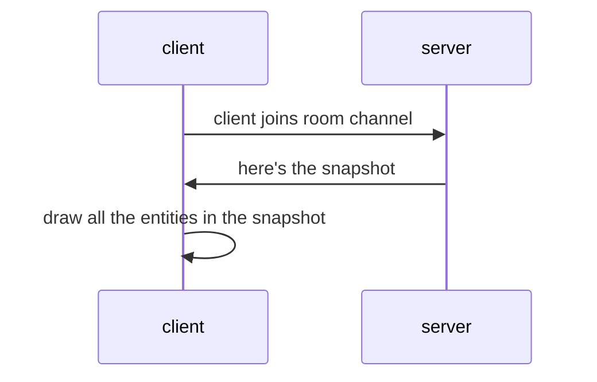
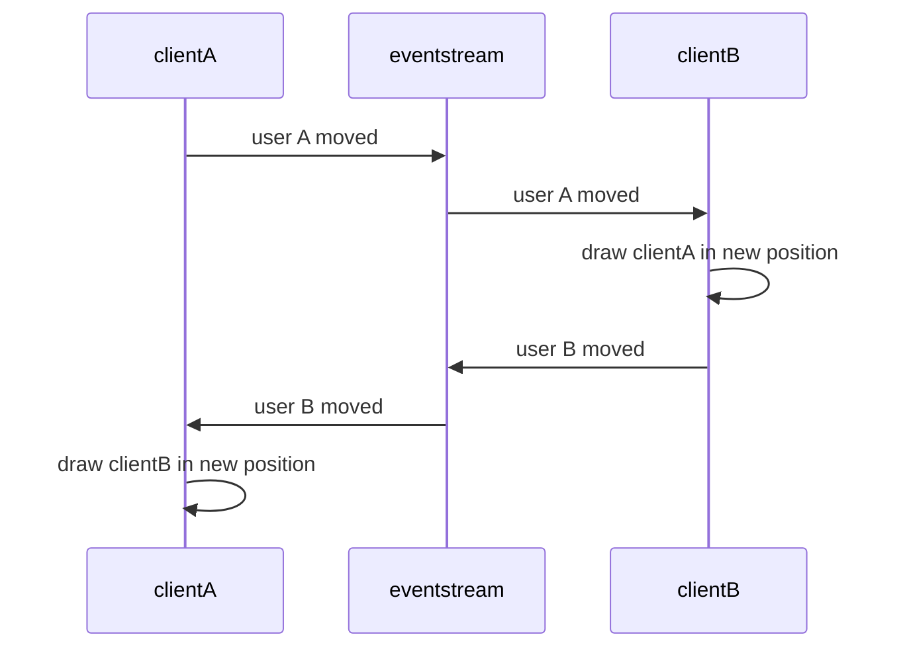

### Event Driven Architecture

If you haven't already noticed, we're going to be relying on a lot of server messages (aka events).  

Here's a diagram of what we've implemented so far:


We also need to define a structure for additional events for things that will happen in our game.

### First-Person Shooter Game Events

When I was in highschool, a popular first person shooter game at that time was DOOM.  If we list out all the types of events that can occur in a game like that we'd come up with something like this:

#### Domain Events

1. Player moving around
2. Player discharging a weapon
3. Player triggering a door open
4. Monster moving around
5. Monster throwing a fireball
6. Player hit by a fireball
7. Monster hit by a bullet
8. Monster dies
9.  Collecting a weapon
10. Switching to a different weapon
11. Collecting health
12. Collecting immunity
13. Collecting ammo
14. Collecting a key
15. Player reached end goal, game over
16. Player was killed, game over

In this approach we'd have a large list of different distinct facts that happen at particular times.  Each event reads like a story.  This thing did this.  Then this other thing did this.

These events might look like this:

```json
{ event_name: "monster_moved", id: "monster1", position: [...]},
{ event_name: "weapon_fired", user_id: "tom", hand_position: [...], weapon_direction: [...], velocity: [...]}
```

This style of message has an event_name that closely matches the list above.  I call these domain events because they are described using the language of the domain.  If we were intending to create a log that is most human readible this might be it.  If there aren't a large number of different kinds of events, it might be straight forward to use this style of schema.

#### Entity/Component Events

Or perhaps we could use a more uniform event following the entity, component, system style:

```json
{event: "update", { entity_id: "monster1", components: {position: [...]}}},
{event: "create", { entity_id: "rand-bullet-id", components: {direction: [...], position: [...], velocity: [...]}}}
```

In this second schema style, the format is more consistent and more rigid having an envelope of { entity: ... , components: } for every kind of event.  It prioritizes reusablity of a fixed set of components.  This has the advantage of not specifying or needing to match on event names or creating new events names for more behaviors, rather one would create new component names for use by systems.  This styles is more CRUDy in that it involves either creating a new entity, or updating it (it's components), or deleting an entity.  It's easier to create a snapshot of the world from these events since there are only a small number of operations.

In fact we could orient the messages as component first rather than entity first:

```json
{ 
    position: {thing1: [...], thing2: [...]}
    velocity: {thing3: [...]}
}
```


#### Snapshot Events

Another approach that can work is to send a snapshot of the current state of the world.  Instead of sending individual entity based messages, you send the state of every entity constantly.  This would be a list of all the enemy positions, every bullet in flight, every player's state, etc.  And the client would need to render the updates, create any added entities, or remove any entities not in the snapshot.

This might lead to very large payloads so maybe we only want to send a list of the entities that had changed since the last event.  This snapshot might look like this:

```json
{monsters: [], players: [], keys: [], doors: [], bullets: [], ...}
```

### Event Sourcing
  

There is an architectural pattern called event sourcing where we strategically put every thing important to us that can happen (in a room, in our case) into an ordered stream of events (called an Event Stream).  An event is a fact that has just happened.  It has just enough information to allow us to re-create the state (or view/projection) purely from processing those events in order again.  

We can have any number of subscribers listening to the event stream building up their own "projections", aka views of the data that are built-up by processing each event.

The event stream sort of behaves like an eventbus, where each client is simultaneously a producer and consumer of events.



But even more powerfully, we can store the event stream as a log.

This becomes very useful for auditing because you have a perfect record of everything that happened.  It's useful for testing and debugging because we can replay the events into the UI to see if the view renders everything correctly based off of the events.  And we get a system that can record and replay our own movements in VR as animations.

### Message Producers

A message can originate from different sources depending on these scenarios:

1. Initial state snapshot.  We already implemented this.  This message originates from the server and is sent to the client when they join so they can draw all the initial scene.
2. User generated events.  These are messages that the user initiates by taking some action.  These messages originate in the front-end and are sent to the server and then broadcast to all the other connected clients.
3. System generated events.  These are messages that are indirectly triggered by something that has happened.  It could even be just the passing of time.  For example we could have a system that emits periodic events to open a door every 60 seconds then close 15 seconds after that.  We could have a system observe if bullets actually hit zombies and emit an event that the zombie was killed.  These events also originate on the client but should only come from one client otherwise we could end up with duplicate or conflicting events if they are calculated on every client.
4. Server generated event.  Lastly these types of events come from the server and supplement events that cannot be generated on the client side.  For example the client cannot tell us they have left if they just close their browser and disconnect.  The server however can detect that the client has detached and emit an event that that user left.

### Phoenix PubSub as an Event Stream

Phoenix comes with a library called PubSub which allows any process to subscribe or broadcast on a named topic.  This is very convenient to easily allow any Elixir process to talk to another process.  

Here's an example of how to use PubSub in the iex terminal:

```elixir
alias Phoenix.PubSub
PubSub.subscribe(Xr.PubSub, "stream:123")
:ok
Process.info(self(), :messages)
{:messages, []}
PubSub.broadcast(Xr.PubSub, "stream:123", {"user_moved", %{"user_id" => "tom", "pose" => ...}})
:ok
Process.info(self(), :messages)
{:messages, [{"user_moved", %{"user_id" => "tom", "pose" => ...}}]}
```
In this simple example we subscribe to a topic "stream:123", broadcast a message to it and then see that our process mailbox received the message.

This understanding sets us up to create an event-stream for our room.  Everything that is important about a room should be broadcast on the stream.
